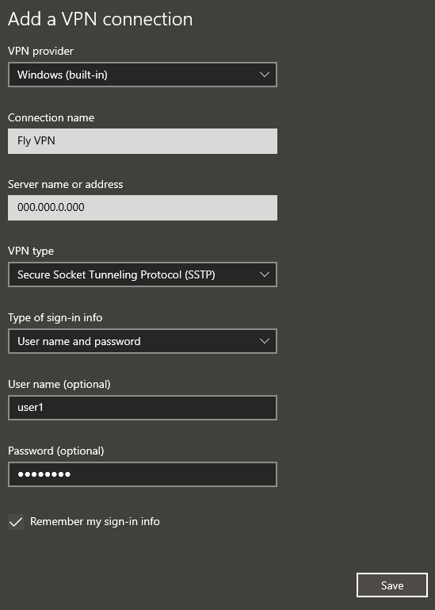

## A SoftEther SSTP VPN Server, hosted by Fly.io

### Notice

This project is cancelled because the SoftEther VPN doesn't work within the Fly.io host environment.
The VPN works correctly when hosted by my laptop; my desktop is able to connect through the vpn when using `nix run .#start`.
However, when the container is hosted by Fly.io through `nix run .#deploy`, while some connections work, many internet functions fail to work through the VPN.
Some computers refuse to connect to the deployed Fly.io server at all.
The container reports the following warnings while running:

```txt
Warning: Extension connmark revision 0 not supported, missing kernel module?
iptables: No chain/target/match by that name.
```

These might imply that the Fly.io server doesn't offer the right privileges to host a VPN in the way Softether does; or, it doesn't have the right kernel support.
Either way, it's enough to tell me that Softether SSTP is not a match for Fly.io.

This is (supposed to be) a scale-to-zero VPN server that Windows' built-in VPN client can connect to by IP address + username + password.
It works when hosted in a Podman or Docker container in any general purpose linux server.

**This project is abandoned. If you are looking for a way to play LAN games with your friends, I recommend using [Radmin VPN](https://www.radmin-vpn.com/).**

Questions? [Read the FAQ](#faq).

### Get Started

#### Install Server

First, copy the repository.

- [Clone this repository](https://docs.github.com/en/repositories/creating-and-managing-repositories/cloning-a-repository) from GitHub to your computer.

Because Nix manages all packages, it is the only dependency required to be installed manually.

- [Install Nix](https://nixos.org/download/).
- [Enable Flakes](https://nixos.wiki/wiki/Flakes).

Now you are ready to configure the server!

#### Configure Server

The VPN server must be configured by a secret file named `.env`. Create the file named `.env` in the root directory of this repository, and declare the following settings:

`.env`

```sh
SOFTETHER_PASS="password"
HUB_PASS="password"
IPSEC_PSK="notsecret"
USER_PASS_PAIRS="user1:password user2:password user3:password"
```

Now you are ready to deploy the server!

#### Deploy to Fly.io

- [Make a Fly.io account](https://fly.io/dashboard). Link your payment method in the account.
- Run `nix develop` to open a shell with access to development tools (like `flyctl`).
- Run `flyctl auth login`
- Determine your `<unique_app_name>`.
- Set `app = '<unique_app_name>'` in `fly.toml`.
- Add line `FLY_APP_NAME="<unique_app_name>"` to `.env`.
- Run `flyctl launch --no-deploy --ha=false --name <unique_app_name>`
- Run `fly volume create backup -r 'den' -n 1`.
- Run `flyctl tokens create deploy` to generate your `<fly_api_token>`.
- Add line `FLY_API_TOKEN="<fly_api_token>"` to `.env`.
- Run `nix run .#deploy`

#### Update a Client Certificate (Windows 10)

- Run `nix develop` to open a shell with access to development tools (like `flyctl`).
- Run `flyctl logs`.
- Start the server init script.
- Copy the certificate text from `/usr/vpnserver/store/server.crt` into a file `server.crt`.
- Download the `.crt` file to the client's Windows 10 computer.
- Double click the `.crt` file to open it with Crypto Shell Extensions.
- Click `Install Certificate...`.
- Select `Local Machine`.
- Click `Next`.
- Click `Yes` to give administrator privileges.
- Select `Place all certificates in the following store`.
- Click `Browse...`.
- Select `Trusted Root Certification Authorities`.
- Click `OK`.
- Click `Next`.
- Click `Finish`.

#### Connect a Client (Windows 10)

- Open Windows 10 Settings.
- Click `Network & Internet`.
- Click `VPN`.
- Click `Add a VPN connection`.
  
- Select `Windows (built-in)` under "VPN provider".
- Name the VPN under "Connection name".
- Put the common name (cn) of the server under "Server name or address". The common name of your server is given by the server when the server init script is run alongside the `.crt` file. It will be either an IP address or a DNS URL.
- Select `Secure Socket Tunneling Protocol (SSTP)` under "VPN type".
- Write your `<username>` under "User name".
- Write your `<password>` under "Password".
- Click `Save`.
- Click the VPN connection you just made and select `Connect`.

#### Scripts

Scripts can be run from within the project directories using any shell with Nix installed and Flakes enabled.
See [#### Install Server](#install-server).

| Command                     | Description |
|:--- |:--- |
| `nix run`                   | Alias for `.#help` |
| `nix run .#help`            | Print this helpful information |
| `nix run .#start`           | Start the server in a container on your machine |
| `nix run .#deploy`          | Deploy the server & secrets to Fly.io |
| `nix develop`               | Start a dev shell with all project dependencies installed |

### FAQ

#### What is this for?

**This project is abandoned. If you are looking for a way to play LAN games with your friends, I recommend using [Radmin VPN](https://www.radmin-vpn.com/).**

You can have all your friends connect to this VPN simultaneously.
When everyone's connected, LAN multiplayer games should allow you to play together.
Now you can have LAN parties online, and nobody has to install or pay for a proprietary VPN client.

Fly doesn't charge you when your app isn't computing anything.
So when you're not using the VPN, it's not costing you money.

#### How does it work?

[Nix (the package manager)](https://nixos.org/) uses [declarative scripting](https://en.wikipedia.org/wiki/Declarative_programming) to:

- Install and lock dependencies.
- Compile the server into a production-ready package.
- Build the package into a [Docker image](https://docs.docker.com/get-started/docker-concepts/the-basics/what-is-an-image/).
- Deploy the Docker image to [Fly.io](https://fly.io/).

[SoftEther (the VPN server)](https://www.softether.org/) provides a tunnel through which devices may route their internet connections.
Devices can connect to this VPN using any client software that supports the SSTP protocol, *including the VPN client built-in to Microsoft Windows*.
When multiple devices connect to the VPN at the same time, they can connect with each other over LAN, as if they were plugged into the same switch.

The SSTP protocol uses TLS instead of UDP, meaning that all traffic is encrypted by default.
Another benefit of TLS is that the server can use a "shared" IP address, whereas UDP would require a "static" IP address.
Fly.io would charge extra for you to reserve a static IPv4 address, and many ISP networks don't support IPv6 in 2025.
So it is cheapest to host a VPN server that uses SSTP+TLS.

Fly.io provides a great hosting service that allows you to run Docker images on a distributed computing network as if they were a VPS.
The platform enables you to create extremely cost-effective low-latency servers.
If you are interested in how they achieve this, [check out the Fly.io docs](https://fly.io/docs/reference/architecture/).

If you have any questions, please first do your best to read the code and understand it, starting at the entrypoint of the program in `flake.nix`.
If you have any errors, first try to identify why the error occurs and fix it yourself.
Then if you still can't figure it out, or if you think you have something valuable to share, please post a GitHub Issue to this repository.
Other users may benefit from community sharing.

#### How to contribute?

This project doesn't support community contributions to the code base right now.
You are free to post Issues in this repository, and if enough interest is generated, a process for community pull requests will be provided.

We are not currently receiving donations.
There is no way to fund the project at this time, but if enough interested is generated, a process for donations will be provided.

Feel free to fork, just be sure to [read the license](./LICENSE.md).
